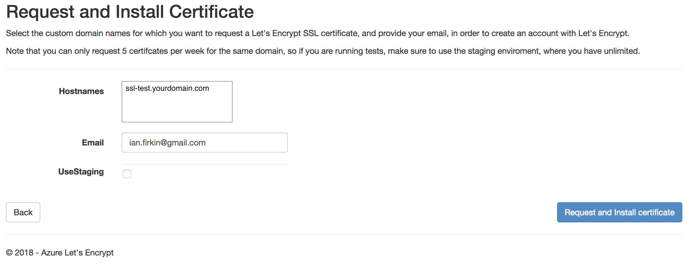

# Azure Function SSL

Experimental repository for using letsencrypt to apply an arbitrary HTTPS DNS entry to an Azure Function

## Summary

Uses the [letsencrypt-siteextension](https://github.com/sjkp/letsencrypt-siteextension) to request and update a letsencrypt certificate an Azure Function App, as outlined [here](https://github.com/sjkp/letsencrypt-siteextension/wiki/Azure-Functions-Support).

This is a working example that attempts to automate the configuration and deployment as much as possible.

## Prerequisites

You need [Terraform]() and the [Azure CLI]() installed:

```bash
brew install terraform
brew install
```

To configure Terraform, you need to set some environment variables for the Azure account you want to use:

```bash
#!/bin/sh
echo "Setting environment variables for Terraform"
export ARM_SUBSCRIPTION_ID=your_subscription_id
export ARM_CLIENT_ID=your_appId
export ARM_CLIENT_SECRET=your_password
export ARM_TENANT_ID=your_tenant_id

# Not needed for public, required for usgovernment, german, china
export ARM_ENVIRONMENT=public
```

The account you use needs to have `Contributor` access to the subscription where you want the function app to be created.

## Deployment

Once your environment is set up, you can run a single command:

```bash
./deploy.sh
```

This will create a resource group and a function app, together with an application insights instance and app service plan.  It will also publish two functions to the app:  `Hello` and `letsencrypt`.

## Manual Steps

### Installing the Let's Encrypt extension

Once the function app is in place, you need to manually install the [letsencrypt-siteextension](https://github.com/sjkp/letsencrypt-siteextension) extension.  It's easiest to do this from kudu (browse to `https://azure-functions-ssl-test.scm.azurewebsites.net/SiteExtensions`).

### Adding a CNAME

Before you can request a cert, you need to have a CNAME pointed at the domain name of your function app (in this example, `azure-functions-ssl-test.azurewebsites.net`).  You can do this from whatever DNS provider you're using.  For these examples, we'll assume the CNAME is

```bash
ssl-test.yourdomain.com
```

### Configuring the extension

TThe deployment script should take care of all the required configuration (app config values, proxy, etc).  You do need to launch the extension, then "next" through config settings to request the first cert.  You can do this from kudu as well, browsing to `https://azure-functions-ssl-test.scm.azurewebsites.net/SiteExtensions` and clicking the "Launch" button, then proceeding to the "Request and Install Certificate" page:



After the initial request, the web job should handle renewals.

## Testing

Assuming your cert request succeeded, you should be able to verify the functionality using the `Hello` function.  Open a web browser, and navigate to:

```bash
https://ssl-test.yourdomain.com/api/hello
```

If everything is working properly, you should get back a response like:

```xml
<string xmlns="http://schemas.microsoft.com/2003/10/Serialization/">Hello!</string>
```